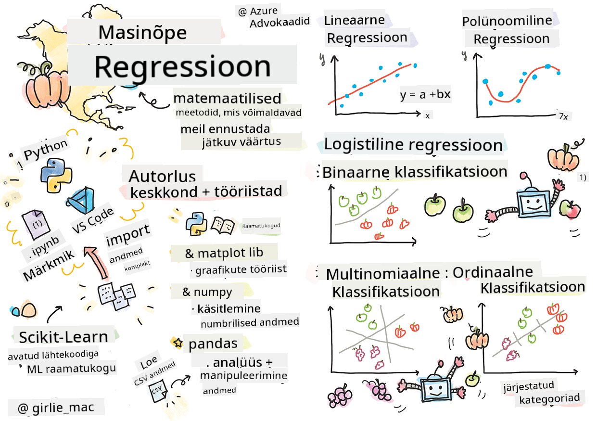
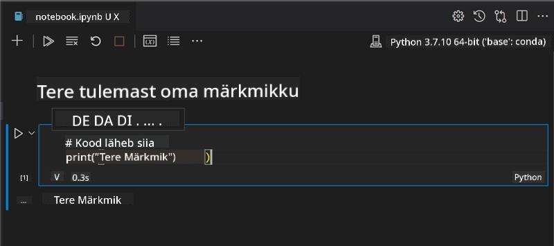
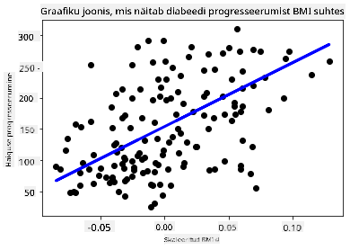

<!--
CO_OP_TRANSLATOR_METADATA:
{
  "original_hash": "fa81d226c71d5af7a2cade31c1c92b88",
  "translation_date": "2025-10-11T11:43:52+00:00",
  "source_file": "2-Regression/1-Tools/README.md",
  "language_code": "et"
}
-->
# Alusta Pythoni ja Scikit-learniga regressioonimudelite jaoks



> Visuaalne märge: [Tomomi Imura](https://www.twitter.com/girlie_mac)

## [Eelloengu viktoriin](https://ff-quizzes.netlify.app/en/ml/)

> ### [See õppetund on saadaval ka R-is!](../../../../2-Regression/1-Tools/solution/R/lesson_1.html)

## Sissejuhatus

Nendes neljas õppetunnis õpid, kuidas luua regressioonimudeleid. Arutame peagi, milleks need vajalikud on. Enne alustamist veendu, et sul on õiged tööriistad paigas!

Selles õppetunnis õpid:

- Kuidas seadistada oma arvuti kohalike masinõppe ülesannete jaoks.
- Kuidas töötada Jupyteri märkmikega.
- Kuidas kasutada Scikit-learni, sealhulgas selle paigaldamist.
- Kuidas uurida lineaarset regressiooni praktilise harjutuse kaudu.

## Paigaldused ja seadistused

[](https://youtu.be/-DfeD2k2Kj0 "ML algajatele - Seadista oma tööriistad masinõppemudelite loomiseks")

> 🎥 Klõpsa ülaloleval pildil, et vaadata lühikest videot arvuti seadistamisest ML jaoks.

1. **Paigalda Python**. Veendu, et [Python](https://www.python.org/downloads/) on sinu arvutisse paigaldatud. Pythonit kasutatakse paljude andmeteaduse ja masinõppe ülesannete jaoks. Enamik arvutisüsteeme sisaldab juba Pythonit. Kasulikud [Python Coding Packs](https://code.visualstudio.com/learn/educators/installers?WT.mc_id=academic-77952-leestott) võivad samuti seadistamist lihtsustada.

   Mõned Python kasutusviisid nõuavad ühte versiooni tarkvarast, samas kui teised vajavad teist versiooni. Seetõttu on kasulik töötada [virtuaalses keskkonnas](https://docs.python.org/3/library/venv.html).

2. **Paigalda Visual Studio Code**. Veendu, et Visual Studio Code on sinu arvutisse paigaldatud. Järgi neid juhiseid, et [paigaldada Visual Studio Code](https://code.visualstudio.com/) põhilise paigalduse jaoks. Selles kursuses kasutad Pythonit Visual Studio Code'is, seega võib olla kasulik tutvuda, kuidas [Visual Studio Code'i seadistada](https://docs.microsoft.com/learn/modules/python-install-vscode?WT.mc_id=academic-77952-leestott) Python arenduseks.

   > Tutvu Pythoniga, läbides selle [õppemoodulite kogumiku](https://docs.microsoft.com/users/jenlooper-2911/collections/mp1pagggd5qrq7?WT.mc_id=academic-77952-leestott)
   >
   > [](https://youtu.be/yyQM70vi7V8 "Seadista Python Visual Studio Code'iga")
   >
   > 🎥 Klõpsa ülaloleval pildil, et vaadata videot: Python kasutamine VS Code'is.

3. **Paigalda Scikit-learn**, järgides [neid juhiseid](https://scikit-learn.org/stable/install.html). Kuna pead kasutama Python 3, on soovitatav kasutada virtuaalset keskkonda. Kui paigaldad seda teeki M1 Macile, on ülaltoodud lehel spetsiaalsed juhised.

4. **Paigalda Jupyter Notebook**. Pead [paigaldama Jupyter paketi](https://pypi.org/project/jupyter/).

## Sinu ML arenduskeskkond

Sa hakkad kasutama **märkmikke**, et arendada oma Python koodi ja luua masinõppemudeleid. Seda tüüpi fail on andmeteadlaste seas levinud tööriist ja neid saab tuvastada nende laiendi `.ipynb` järgi.

Märkmikud on interaktiivne keskkond, mis võimaldab arendajal nii koodi kirjutada kui ka märkmeid lisada ja dokumentatsiooni koostada, mis on eksperimentaalsete või uurimuslike projektide jaoks väga kasulik.

[](https://youtu.be/7E-jC8FLA2E "ML algajatele - Seadista Jupyter märkmikud regressioonimudelite loomiseks")

> 🎥 Klõpsa ülaloleval pildil, et vaadata lühikest videot selle harjutuse läbiviimisest.

### Harjutus - töö märkmikuga

Selles kaustas leiad faili _notebook.ipynb_.

1. Ava _notebook.ipynb_ Visual Studio Code'is.

   Jupyter server käivitub koos Python 3+ versiooniga. Märkmikus leiad alasid, mida saab `käivitada`, koodilõike. Koodilõiku saab käivitada, valides ikooni, mis näeb välja nagu mängimise nupp.

2. Vali `md` ikoon ja lisa veidi markdowni ning järgmine tekst **# Tere tulemast oma märkmikku**.

   Järgmisena lisa veidi Python koodi.

3. Kirjuta **print('hello notebook')** koodilõiku.
4. Vali nool, et koodi käivitada.

   Näed järgmist väljundit:

    ```output
    hello notebook
    ```



Sa saad oma koodi vaheldumisi kommentaaridega täiendada, et märkmikku ise dokumenteerida.

✅ Mõtle hetkeks, kui erinev on veebiarendaja töökeskkond võrreldes andmeteadlase omaga.

## Scikit-learniga alustamine

Nüüd, kui Python on sinu kohalikus keskkonnas seadistatud ja oled Jupyter märkmikega mugav, on aeg saada sama mugavaks Scikit-learniga (häälda `sci` nagu `science`). Scikit-learn pakub [ulatuslikku API-d](https://scikit-learn.org/stable/modules/classes.html#api-ref), mis aitab sul ML ülesandeid täita.

Nende [veebisaidi](https://scikit-learn.org/stable/getting_started.html) järgi on "Scikit-learn avatud lähtekoodiga masinõppe teek, mis toetab juhendatud ja juhendamata õppimist. See pakub ka mitmesuguseid tööriistu mudelite sobitamiseks, andmete eeltöötluseks, mudelite valikuks ja hindamiseks ning palju muid kasulikke funktsioone."

Selles kursuses kasutad Scikit-learni ja teisi tööriistu, et luua masinõppemudeleid, mis täidavad nn "traditsioonilise masinõppe" ülesandeid. Oleme teadlikult vältinud närvivõrke ja süvaõpet, kuna need on paremini kaetud meie tulevases "AI algajatele" õppekavas.

Scikit-learn muudab mudelite loomise ja nende hindamise lihtsaks. See keskendub peamiselt numbriliste andmete kasutamisele ja sisaldab mitmeid valmisandmekogumeid, mida saab kasutada õppematerjalidena. Samuti sisaldab see eelvalmistatud mudeleid, mida õpilased saavad proovida. Uurime protsessi, kuidas laadida eelpakendatud andmeid ja kasutada sisseehitatud hindajat esimese ML mudeli loomiseks Scikit-learniga, kasutades põhiandmeid.

## Harjutus - sinu esimene Scikit-learn märkmik

> See õpetus on inspireeritud [lineaarse regressiooni näitest](https://scikit-learn.org/stable/auto_examples/linear_model/plot_ols.html#sphx-glr-auto-examples-linear-model-plot-ols-py) Scikit-learni veebisaidil.

[](https://youtu.be/2xkXL5EUpS0 "ML algajatele - Sinu esimene lineaarse regressiooni projekt Pythonis")

> 🎥 Klõpsa ülaloleval pildil, et vaadata lühikest videot selle harjutuse läbiviimisest.

Failis _notebook.ipynb_, mis on seotud selle õppetunniga, kustuta kõik lahtrid, vajutades prügikasti ikooni.

Selles osas töötad väikese diabeedi andmekogumiga, mis on Scikit-learnis õppimise eesmärgil sisse ehitatud. Kujuta ette, et tahad testida ravi diabeediga patsientide jaoks. Masinõppemudelid võivad aidata kindlaks teha, millised patsiendid reageeriksid ravile paremini, tuginedes muutujate kombinatsioonidele. Isegi väga lihtne regressioonimudel, kui seda visualiseerida, võib näidata teavet muutujate kohta, mis aitaksid korraldada teoreetilisi kliinilisi katseid.

✅ Regressioonimeetodeid on palju erinevaid ja millise valid, sõltub küsimusest, millele vastust otsid. Kui tahad ennustada tõenäolist pikkust inimesele teatud vanuses, kasutaksid lineaarset regressiooni, kuna otsid **numbrilist väärtust**. Kui sind huvitab, kas teatud köök peaks olema vegan või mitte, otsid **kategooria määramist**, seega kasutaksid logistilist regressiooni. Õpid logistilisest regressioonist hiljem rohkem. Mõtle veidi, milliseid küsimusi saad andmetelt küsida ja milline neist meetoditest oleks sobivam.

Alustame ülesandega.

### Teekide importimine

Selle ülesande jaoks impordime mõned teegid:

- **matplotlib**. See on kasulik [graafikute tööriist](https://matplotlib.org/) ja kasutame seda joondiagrammi loomiseks.
- **numpy**. [numpy](https://numpy.org/doc/stable/user/whatisnumpy.html) on kasulik teek numbriliste andmete käsitlemiseks Pythonis.
- **sklearn**. See on [Scikit-learn](https://scikit-learn.org/stable/user_guide.html) teek.

Impordi mõned teegid, mis aitavad ülesande täitmisel.

1. Lisa impordid, kirjutades järgmise koodi:

   ```python
   import matplotlib.pyplot as plt
   import numpy as np
   from sklearn import datasets, linear_model, model_selection
   ```

   Ülal impordid `matplotlib`, `numpy` ja impordid `datasets`, `linear_model` ja `model_selection` teegist `sklearn`. `model_selection` kasutatakse andmete jagamiseks treening- ja testkomplektideks.

### Diabeedi andmekogum

Sisseehitatud [diabeedi andmekogum](https://scikit-learn.org/stable/datasets/toy_dataset.html#diabetes-dataset) sisaldab 442 diabeediga seotud andmeproovi, millel on 10 tunnuse muutujat, millest mõned on:

- age: vanus aastates
- bmi: kehamassiindeks
- bp: keskmine vererõhk
- s1 tc: T-rakud (teatud tüüpi valged verelibled)

✅ See andmekogum sisaldab tunnuse muutujana "sugu", mis on oluline diabeedi uurimisel. Paljud meditsiinilised andmekogumid sisaldavad sellist binaarset klassifikatsiooni. Mõtle veidi, kuidas sellised kategooriad võivad teatud osa elanikkonnast ravist välja jätta.

Nüüd laadi X ja y andmed.

> 🎓 Pea meeles, et see on juhendatud õppimine ja vajame nimetatud 'y' sihtmärki.

Uues koodilahtris laadi diabeedi andmekogum, kutsudes `load_diabetes()`. Sisend `return_X_y=True` näitab, et `X` on andmemaatriks ja `y` on regressiooni sihtmärk.

1. Lisa mõned print-käsud, et näidata andmemaatriksi kuju ja selle esimest elementi:

    ```python
    X, y = datasets.load_diabetes(return_X_y=True)
    print(X.shape)
    print(X[0])
    ```

    Saad vastuseks tupli. Mida teed, on tupli kahe esimese väärtuse määramine vastavalt `X` ja `y`. Loe rohkem [tuplite kohta](https://wikipedia.org/wiki/Tuple).

    Näed, et need andmed sisaldavad 442 üksust, mis on kujundatud 10 elemendiga massiivideks:

    ```text
    (442, 10)
    [ 0.03807591  0.05068012  0.06169621  0.02187235 -0.0442235  -0.03482076
    -0.04340085 -0.00259226  0.01990842 -0.01764613]
    ```

    ✅ Mõtle veidi andmete ja regressiooni sihtmärgi vahelisele seosele. Lineaarne regressioon ennustab seoseid tunnuse X ja sihtmuutuja y vahel. Kas leiad diabeedi andmekogumi [sihtmärgi](https://scikit-learn.org/stable/datasets/toy_dataset.html#diabetes-dataset) dokumentatsioonist? Mida see andmekogum näitab, arvestades sihtmärki?

2. Järgmisena vali osa sellest andmekogumist, mida graafikul kuvada, valides andmekogumi 3. veeru. Seda saab teha, kasutades `:` operaatorit kõigi ridade valimiseks ja seejärel valides 3. veeru indeksi (2) abil. Samuti saad andmed kujundada 2D massiiviks - nagu graafiku jaoks vajalik - kasutades `reshape(n_rows, n_columns)`. Kui üks parameetritest on -1, arvutatakse vastav mõõde automaatselt.

   ```python
   X = X[:, 2]
   X = X.reshape((-1,1))
   ```

   ✅ Igal ajal prindi andmed välja, et kontrollida nende kuju.

3. Nüüd, kui andmed on graafiku jaoks valmis, saad näha, kas masin suudab määrata loogilise jaotuse numbrite vahel selles andmekogumis. Selleks pead jagama nii andmed (X) kui ka sihtmärgi (y) test- ja treeningkomplektideks. Scikit-learnil on selleks lihtne viis; saad jagada oma testandmed kindlas punktis.

   ```python
   X_train, X_test, y_train, y_test = model_selection.train_test_split(X, y, test_size=0.33)
   ```

4. Nüüd oled valmis oma mudelit treenima! Laadi lineaarse regressiooni mudel ja treeni seda oma X ja y treeningkomplektidega, kasutades `model.fit()`:

    ```python
    model = linear_model.LinearRegression()
    model.fit(X_train, y_train)
    ```

    ✅ `model.fit()` on funktsioon, mida näed paljudes ML teekides, nagu TensorFlow

5. Seejärel loo ennustus, kasutades testandmeid, funktsiooni `predict()` abil. Seda kasutatakse joone joonistamiseks kõige sobivamasse kohta andmegruppide vahel.

    ```python
    y_pred = model.predict(X_test)
    ```

6. Nüüd on aeg andmeid graafikul kuvada. Matplotlib on selleks ülesandeks väga kasulik tööriist. Loo hajusdiagramm kõigist X ja y testandmetest ning kasuta ennustust, et joonistada joon kõige sobivamasse kohta mudeli andmegruppide vahel.

    ```python
    plt.scatter(X_test, y_test,  color='black')
    plt.plot(X_test, y_pred, color='blue', linewidth=3)
    plt.xlabel('Scaled BMIs')
    plt.ylabel('Disease Progression')
    plt.title('A Graph Plot Showing Diabetes Progression Against BMI')
    plt.show()
    ```

   
✅ Mõtle veidi, mis siin toimub. Sirgjoon kulgeb läbi paljude väikeste andmepunktide, kuid mida see täpselt teeb? Kas näed, kuidas saaksid seda joont kasutada, et ennustada, kuhu uus, seni nägemata andmepunkt peaks graafiku y-telje suhtes sobituma? Proovi sõnastada selle mudeli praktiline kasutus.

Palju õnne, sa ehitasid oma esimese lineaarse regressioonimudeli, tegid sellega ennustuse ja kuvad selle graafikul!

---
## 🚀Väljakutse

Kuvage graafikul mõni muu muutuja sellest andmestikust. Vihje: muuda seda rida: `X = X[:,2]`. Arvestades selle andmestiku sihtmärki, mida saate avastada diabeedi kui haiguse progresseerumise kohta?

## [Loengu järgne viktoriin](https://ff-quizzes.netlify.app/en/ml/)

## Ülevaade ja iseseisev õppimine

Selles juhendis töötasite lihtsa lineaarse regressiooniga, mitte univariatiivse või mitme muutujaga regressiooniga. Lugege veidi nende meetodite erinevuste kohta või vaadake [seda videot](https://www.coursera.org/lecture/quantifying-relationships-regression-models/linear-vs-nonlinear-categorical-variables-ai2Ef).

Lugege rohkem regressiooni kontseptsiooni kohta ja mõelge, millistele küsimustele saab selle tehnikaga vastata. Võtke see [juhend](https://docs.microsoft.com/learn/modules/train-evaluate-regression-models?WT.mc_id=academic-77952-leestott), et süvendada oma arusaamist.

## Ülesanne

[Teistsugune andmestik](assignment.md)

---

**Lahtiütlus**:  
See dokument on tõlgitud AI tõlketeenuse [Co-op Translator](https://github.com/Azure/co-op-translator) abil. Kuigi püüame tagada täpsust, palume arvestada, et automaatsed tõlked võivad sisaldada vigu või ebatäpsusi. Algne dokument selle algses keeles tuleks pidada autoriteetseks allikaks. Olulise teabe puhul soovitame kasutada professionaalset inimtõlget. Me ei vastuta selle tõlke kasutamisest tulenevate arusaamatuste või valesti tõlgenduste eest.