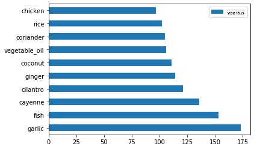
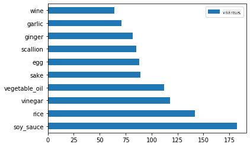
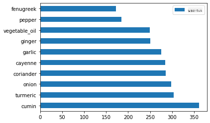
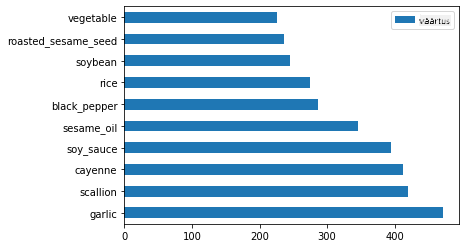

<!--
CO_OP_TRANSLATOR_METADATA:
{
  "original_hash": "aaf391d922bd6de5efba871d514c6d47",
  "translation_date": "2025-10-11T11:55:36+00:00",
  "source_file": "4-Classification/1-Introduction/README.md",
  "language_code": "et"
}
-->
# Sissejuhatus klassifikatsiooni

Nendes neljas õppetunnis uurid klassikalise masinõppe põhivaldkonda - _klassifikatsiooni_. Vaatame erinevate klassifikatsioonialgoritmide kasutamist andmekogumiga, mis käsitleb Aasia ja India suurepäraseid kööke. Loodetavasti oled näljane!


> Tähista pan-Aasia kööke nendes õppetundides! Pilt: [Jen Looper](https://twitter.com/jenlooper)

Klassifikatsioon on [juhendatud õppe](https://wikipedia.org/wiki/Supervised_learning) vorm, mis sarnaneb paljuski regressioonitehnikatega. Kui masinõpe seisneb väärtuste või nimede ennustamises andmekogumite abil, siis klassifikatsioon jaguneb üldiselt kahte rühma: _binaarne klassifikatsioon_ ja _mitmeklassiline klassifikatsioon_.

[](https://youtu.be/eg8DJYwdMyg "Sissejuhatus klassifikatsiooni")

> 🎥 Klõpsa ülaloleval pildil, et vaadata videot: MIT-i John Guttag tutvustab klassifikatsiooni

Pea meeles:

- **Lineaarne regressioon** aitas sul ennustada muutujate vahelisi seoseid ja teha täpseid prognoose, kuhu uus andmepunkt selle joone suhtes paigutub. Näiteks võisid ennustada _kõrvitsa hinda septembris vs. detsembris_.
- **Logistiline regressioon** aitas sul avastada "binaarseid kategooriaid": selle hinnapunkti juures, _kas kõrvits on oranž või mitte-oranž_?

Klassifikatsioon kasutab erinevaid algoritme, et määrata andmepunkti silt või klass. Töötame selle köögiandmetega, et näha, kas koostisosade rühma jälgides suudame kindlaks teha selle päritoluköögi.

## [Eel-loengu viktoriin](https://ff-quizzes.netlify.app/en/ml/)

> ### [See õppetund on saadaval ka R-is!](../../../../4-Classification/1-Introduction/solution/R/lesson_10.html)

### Sissejuhatus

Klassifikatsioon on üks masinõppe teadlase ja andmeteadlase põhitegevusi. Alates binaarse väärtuse ("kas see e-kiri on rämpspost või mitte?") lihtsast klassifikatsioonist kuni keeruka pildiklassifikatsiooni ja segmentatsioonini arvutinägemise abil, on alati kasulik andmeid klassidesse sorteerida ja neilt küsimusi küsida.

Teaduslikumalt öeldes loob sinu klassifikatsioonimeetod ennustava mudeli, mis võimaldab kaardistada sisendmuutujate ja väljundmuutujate vahelisi seoseid.


> Binaarsed vs. mitmeklassilised probleemid, mida klassifikatsioonialgoritmid peavad lahendama. Infograafika: [Jen Looper](https://twitter.com/jenlooper)

Enne kui alustame andmete puhastamise, visualiseerimise ja ML-ülesannete ettevalmistamise protsessi, õpime veidi erinevaid viise, kuidas masinõpet saab kasutada andmete klassifitseerimiseks.

Klassifikatsioon, mis on tuletatud [statistikast](https://wikipedia.org/wiki/Statistical_classification), kasutab klassikalise masinõppe raames tunnuseid, nagu `smoker`, `weight` ja `age`, et määrata _tõenäosust X haiguse tekkeks_. Juhendatud õppe tehnikana, mis sarnaneb varasemate regressiooniharjutustega, on sinu andmed märgistatud ja ML-algoritmid kasutavad neid silte, et klassifitseerida ja ennustada andmekogumi klasse (või 'tunnuseid') ning määrata need rühma või tulemusse.

✅ Kujuta hetkeks ette andmekogumit köökide kohta. Mida võiks mitmeklassiline mudel vastata? Mida võiks binaarne mudel vastata? Mis siis, kui tahaksid kindlaks teha, kas antud köök kasutab tõenäoliselt lambaläätse? Mis siis, kui tahaksid näha, kas saad kingitud toidukotist, mis sisaldab tähtaniisi, artišokki, lillkapsast ja mädarõigast, valmistada tüüpilise India roa?

[](https://youtu.be/GuTeDbaNoEU "Hullud müstilised korvid")

> 🎥 Klõpsa ülaloleval pildil, et vaadata videot. Saate 'Chopped' kogu idee seisneb 'müstilises korvis', kus kokad peavad valmistama roa juhuslikult valitud koostisosadest. Kindlasti aitaks ML-mudel!

## Tere, 'klassifikaator'

Küsimus, mida tahame selle köögiandmekogumi kohta küsida, on tegelikult **mitmeklassiline küsimus**, kuna meil on mitu võimalikku rahvuskööki, millega töötada. Arvestades koostisosade kogumit, millisesse nendest paljudest klassidest andmed sobivad?

Scikit-learn pakub mitmeid erinevaid algoritme andmete klassifitseerimiseks, sõltuvalt probleemist, mida soovid lahendada. Järgmistes kahes õppetunnis õpid mitmeid neist algoritmidest.

## Harjutus - puhasta ja tasakaalusta oma andmed

Esimene ülesanne enne projekti alustamist on andmete puhastamine ja **tasakaalustamine**, et saada paremaid tulemusi. Alusta kaustas oleva tühja _notebook.ipynb_ failiga.

Esimene asi, mida installida, on [imblearn](https://imbalanced-learn.org/stable/). See on Scikit-learn pakett, mis võimaldab sul andmeid paremini tasakaalustada (õpid sellest ülesandest rohkem hetkega).

1. `imblearn`i installimiseks käivita `pip install` järgmiselt:

    ```python
    pip install imblearn
    ```

1. Impordi paketid, mida vajad andmete importimiseks ja visualiseerimiseks, samuti impordi `SMOTE` `imblearn`ist.

    ```python
    import pandas as pd
    import matplotlib.pyplot as plt
    import matplotlib as mpl
    import numpy as np
    from imblearn.over_sampling import SMOTE
    ```

    Nüüd oled valmis andmeid importima.

1. Järgmine ülesanne on andmete importimine:

    ```python
    df  = pd.read_csv('../data/cuisines.csv')
    ```

   `read_csv()` abil loetakse csv-faili _cusines.csv_ sisu ja paigutatakse see muutujasse `df`.

1. Kontrolli andmete kuju:

    ```python
    df.head()
    ```

   Esimesed viis rida näevad välja sellised:

    ```output
    |     | Unnamed: 0 | cuisine | almond | angelica | anise | anise_seed | apple | apple_brandy | apricot | armagnac | ... | whiskey | white_bread | white_wine | whole_grain_wheat_flour | wine | wood | yam | yeast | yogurt | zucchini |
    | --- | ---------- | ------- | ------ | -------- | ----- | ---------- | ----- | ------------ | ------- | -------- | --- | ------- | ----------- | ---------- | ----------------------- | ---- | ---- | --- | ----- | ------ | -------- |
    | 0   | 65         | indian  | 0      | 0        | 0     | 0          | 0     | 0            | 0       | 0        | ... | 0       | 0           | 0          | 0                       | 0    | 0    | 0   | 0     | 0      | 0        |
    | 1   | 66         | indian  | 1      | 0        | 0     | 0          | 0     | 0            | 0       | 0        | ... | 0       | 0           | 0          | 0                       | 0    | 0    | 0   | 0     | 0      | 0        |
    | 2   | 67         | indian  | 0      | 0        | 0     | 0          | 0     | 0            | 0       | 0        | ... | 0       | 0           | 0          | 0                       | 0    | 0    | 0   | 0     | 0      | 0        |
    | 3   | 68         | indian  | 0      | 0        | 0     | 0          | 0     | 0            | 0       | 0        | ... | 0       | 0           | 0          | 0                       | 0    | 0    | 0   | 0     | 0      | 0        |
    | 4   | 69         | indian  | 0      | 0        | 0     | 0          | 0     | 0            | 0       | 0        | ... | 0       | 0           | 0          | 0                       | 0    | 0    | 0   | 0     | 1      | 0        |
    ```

1. Saa andmete kohta infot, kutsudes `info()`:

    ```python
    df.info()
    ```

    Väljund sarnaneb:

    ```output
    <class 'pandas.core.frame.DataFrame'>
    RangeIndex: 2448 entries, 0 to 2447
    Columns: 385 entries, Unnamed: 0 to zucchini
    dtypes: int64(384), object(1)
    memory usage: 7.2+ MB
    ```

## Harjutus - köökide tundmaõppimine

Nüüd muutub töö huvitavamaks. Uurime andmete jaotust köökide kaupa.

1. Joonista andmed ribadena, kutsudes `barh()`:

    ```python
    df.cuisine.value_counts().plot.barh()
    ```

    

    Kööke on piiratud arv, kuid andmete jaotus on ebaühtlane. Saad selle parandada! Enne seda uurime veidi rohkem.

1. Uuri, kui palju andmeid on saadaval köögi kohta, ja prindi see välja:

    ```python
    thai_df = df[(df.cuisine == "thai")]
    japanese_df = df[(df.cuisine == "japanese")]
    chinese_df = df[(df.cuisine == "chinese")]
    indian_df = df[(df.cuisine == "indian")]
    korean_df = df[(df.cuisine == "korean")]
    
    print(f'thai df: {thai_df.shape}')
    print(f'japanese df: {japanese_df.shape}')
    print(f'chinese df: {chinese_df.shape}')
    print(f'indian df: {indian_df.shape}')
    print(f'korean df: {korean_df.shape}')
    ```

    Väljund näeb välja selline:

    ```output
    thai df: (289, 385)
    japanese df: (320, 385)
    chinese df: (442, 385)
    indian df: (598, 385)
    korean df: (799, 385)
    ```

## Koostisosade avastamine

Nüüd saad sügavamale andmetesse kaevuda ja teada saada, millised on tüüpilised koostisosad köögi kaupa. Peaksid eemaldama korduvad andmed, mis tekitavad segadust köökide vahel, nii et uurime seda probleemi.

1. Loo Pythonis funktsioon `create_ingredient()`, et luua koostisosade andmeraam. See funktsioon alustab ebaolulise veeru eemaldamisega ja sorteerib koostisosad nende arvu järgi:

    ```python
    def create_ingredient_df(df):
        ingredient_df = df.T.drop(['cuisine','Unnamed: 0']).sum(axis=1).to_frame('value')
        ingredient_df = ingredient_df[(ingredient_df.T != 0).any()]
        ingredient_df = ingredient_df.sort_values(by='value', ascending=False,
        inplace=False)
        return ingredient_df
    ```

   Nüüd saad selle funktsiooni abil aimu kümnest kõige populaarsemast koostisosast köögi kaupa.

1. Kutsu `create_ingredient()` ja joonista see, kutsudes `barh()`:

    ```python
    thai_ingredient_df = create_ingredient_df(thai_df)
    thai_ingredient_df.head(10).plot.barh()
    ```

    

1. Tee sama jaapani andmete jaoks:

    ```python
    japanese_ingredient_df = create_ingredient_df(japanese_df)
    japanese_ingredient_df.head(10).plot.barh()
    ```

    

1. Nüüd hiina koostisosade jaoks:

    ```python
    chinese_ingredient_df = create_ingredient_df(chinese_df)
    chinese_ingredient_df.head(10).plot.barh()
    ```

    

1. Joonista india koostisosad:

    ```python
    indian_ingredient_df = create_ingredient_df(indian_df)
    indian_ingredient_df.head(10).plot.barh()
    ```

    

1. Lõpuks joonista korea koostisosad:

    ```python
    korean_ingredient_df = create_ingredient_df(korean_df)
    korean_ingredient_df.head(10).plot.barh()
    ```

    

1. Nüüd eemalda kõige levinumad koostisosad, mis tekitavad segadust erinevate köökide vahel, kutsudes `drop()`:

   Kõigile meeldib riis, küüslauk ja ingver!

    ```python
    feature_df= df.drop(['cuisine','Unnamed: 0','rice','garlic','ginger'], axis=1)
    labels_df = df.cuisine #.unique()
    feature_df.head()
    ```

## Tasakaalusta andmekogum

Nüüd, kui oled andmed puhastanud, kasuta [SMOTE](https://imbalanced-learn.org/dev/references/generated/imblearn.over_sampling.SMOTE.html) - "Synthetic Minority Over-sampling Technique" - et neid tasakaalustada.

1. Kutsu `fit_resample()`, see strateegia genereerib uusi näidiseid interpolatsiooni teel.

    ```python
    oversample = SMOTE()
    transformed_feature_df, transformed_label_df = oversample.fit_resample(feature_df, labels_df)
    ```

    Andmete tasakaalustamine annab paremaid tulemusi nende klassifitseerimisel. Mõtle binaarsele klassifikatsioonile. Kui enamik sinu andmetest kuulub ühte klassi, ennustab ML-mudel seda klassi sagedamini, lihtsalt seetõttu, et selle kohta on rohkem andmeid. Andmete tasakaalustamine eemaldab selle tasakaalustamatuse.

1. Nüüd saad kontrollida silte koostisosa kohta:

    ```python
    print(f'new label count: {transformed_label_df.value_counts()}')
    print(f'old label count: {df.cuisine.value_counts()}')
    ```

    Väljund näeb välja selline:

    ```output
    new label count: korean      799
    chinese     799
    indian      799
    japanese    799
    thai        799
    Name: cuisine, dtype: int64
    old label count: korean      799
    indian      598
    chinese     442
    japanese    320
    thai        289
    Name: cuisine, dtype: int64
    ```

    Andmed on kenad ja puhtad, tasakaalustatud ja väga maitsvad!

1. Viimane samm on salvestada tasakaalustatud andmed, sealhulgas sildid ja tunnused, uude andmeraami, mida saab eksportida faili:

    ```python
    transformed_df = pd.concat([transformed_label_df,transformed_feature_df],axis=1, join='outer')
    ```

1. Võid andmeid veel kord vaadata, kasutades `transformed_df.head()` ja `transformed_df.info()`. Salvesta nende andmete koopia, et kasutada tulevastes õppetundides:

    ```python
    transformed_df.head()
    transformed_df.info()
    transformed_df.to_csv("../data/cleaned_cuisines.csv")
    ```

    See värske CSV-fail on nüüd leitav juurandmete kaustas.

---

## 🚀Väljakutse

See õppekava sisaldab mitmeid huvitavaid andmekogumeid. Uuri `data` kaustu ja vaata, kas mõni sisaldab andmekogumeid, mis sobiksid binaarseks või mitmeklassiliseks klassifikatsiooniks? Milliseid küsimusi küsiksid selle andmekogumi kohta?

## [Järel-loengu viktoriin](https://ff-quizzes.netlify.app/en/ml/)

## Ülevaade ja iseseisev õppimine

Uuri SMOTE API-d. Millisteks kasutusjuhtudeks see kõige paremini sobib? Milliseid probleeme see lahendab?

## Ülesanne

[Uuri klassifikatsioonimeetodeid](assignment.md)

---

**Lahtiütlus**:  
See dokument on tõlgitud AI tõlketeenuse [Co-op Translator](https://github.com/Azure/co-op-translator) abil. Kuigi püüame tagada täpsust, palume arvestada, et automaatsed tõlked võivad sisaldada vigu või ebatäpsusi. Algne dokument selle algses keeles tuleks pidada autoriteetseks allikaks. Olulise teabe puhul soovitame kasutada professionaalset inimtõlget. Me ei vastuta selle tõlke kasutamisest tulenevate arusaamatuste või valesti tõlgenduste eest.