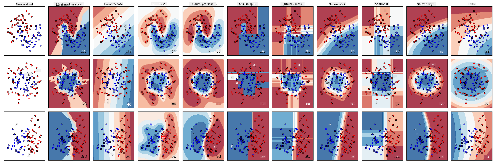
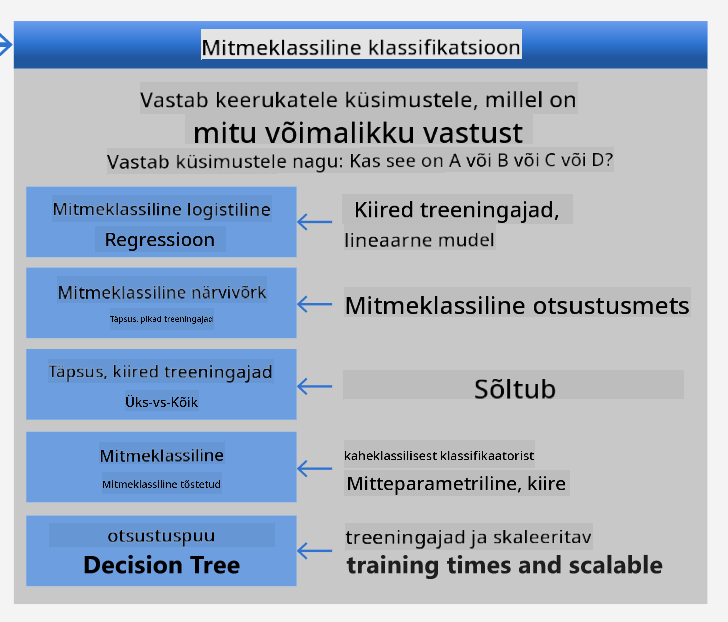
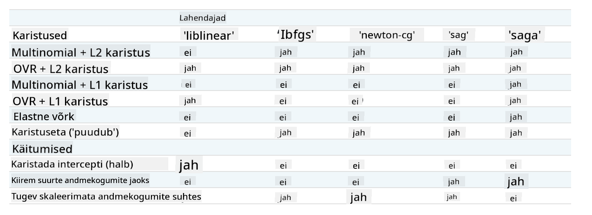

<!--
CO_OP_TRANSLATOR_METADATA:
{
  "original_hash": "1a6e9e46b34a2e559fbbfc1f95397c7b",
  "translation_date": "2025-10-11T11:54:05+00:00",
  "source_file": "4-Classification/2-Classifiers-1/README.md",
  "language_code": "et"
}
-->
# Köögi klassifikaatorid 1

Selles tunnis kasutad eelmises tunnis salvestatud andmestikku, mis sisaldab tasakaalustatud ja puhastatud andmeid erinevate köökide kohta.

Seda andmestikku kasutatakse mitmesuguste klassifikaatoritega, et _ennustada rahvuslikku kööki, lähtudes koostisosade grupist_. Samal ajal õpid rohkem algoritmide kasutamise kohta klassifitseerimisülesannetes.

## [Eelloengu viktoriin](https://ff-quizzes.netlify.app/en/ml/)
# Ettevalmistus

Eeldades, et oled lõpetanud [1. tunni](../1-Introduction/README.md), veendu, et _cleaned_cuisines.csv_ fail asub juurkataloogi `/data` kaustas, mis on mõeldud nende nelja tunni jaoks.

## Harjutus - rahvusliku köögi ennustamine

1. Töötades selle tunni _notebook.ipynb_ kaustas, impordi fail koos Pandas teegiga:

    ```python
    import pandas as pd
    cuisines_df = pd.read_csv("../data/cleaned_cuisines.csv")
    cuisines_df.head()
    ```

    Andmed näevad välja sellised:

|     | Unnamed: 0 | cuisine | almond | angelica | anise | anise_seed | apple | apple_brandy | apricot | armagnac | ... | whiskey | white_bread | white_wine | whole_grain_wheat_flour | wine | wood | yam | yeast | yogurt | zucchini |
| --- | ---------- | ------- | ------ | -------- | ----- | ---------- | ----- | ------------ | ------- | -------- | --- | ------- | ----------- | ---------- | ----------------------- | ---- | ---- | --- | ----- | ------ | -------- |
| 0   | 0          | indian  | 0      | 0        | 0     | 0          | 0     | 0            | 0       | 0        | ... | 0       | 0           | 0          | 0                       | 0    | 0    | 0   | 0     | 0      | 0        |
| 1   | 1          | indian  | 1      | 0        | 0     | 0          | 0     | 0            | 0       | 0        | ... | 0       | 0           | 0          | 0                       | 0    | 0    | 0   | 0     | 0      | 0        |
| 2   | 2          | indian  | 0      | 0        | 0     | 0          | 0     | 0            | 0       | 0        | ... | 0       | 0           | 0          | 0                       | 0    | 0    | 0   | 0     | 0      | 0        |
| 3   | 3          | indian  | 0      | 0        | 0     | 0          | 0     | 0            | 0       | 0        | ... | 0       | 0           | 0          | 0                       | 0    | 0    | 0   | 0     | 0      | 0        |
| 4   | 4          | indian  | 0      | 0        | 0     | 0          | 0     | 0            | 0       | 0        | ... | 0       | 0           | 0          | 0                       | 0    | 0    | 0   | 0     | 1      | 0        |
  

1. Nüüd impordi veel mõned teegid:

    ```python
    from sklearn.linear_model import LogisticRegression
    from sklearn.model_selection import train_test_split, cross_val_score
    from sklearn.metrics import accuracy_score,precision_score,confusion_matrix,classification_report, precision_recall_curve
    from sklearn.svm import SVC
    import numpy as np
    ```

1. Jaga X ja y koordinaadid kaheks andmeraamiks treenimiseks. `cuisine` võib olla siltide andmeraam:

    ```python
    cuisines_label_df = cuisines_df['cuisine']
    cuisines_label_df.head()
    ```

    See näeb välja selline:

    ```output
    0    indian
    1    indian
    2    indian
    3    indian
    4    indian
    Name: cuisine, dtype: object
    ```

1. Eemalda `Unnamed: 0` ja `cuisine` veerud, kasutades `drop()` funktsiooni. Salvesta ülejäänud andmed treenitavate omadustena:

    ```python
    cuisines_feature_df = cuisines_df.drop(['Unnamed: 0', 'cuisine'], axis=1)
    cuisines_feature_df.head()
    ```

    Sinu omadused näevad välja sellised:

|      | almond | angelica | anise | anise_seed | apple | apple_brandy | apricot | armagnac | artemisia | artichoke |  ... | whiskey | white_bread | white_wine | whole_grain_wheat_flour | wine | wood |  yam | yeast | yogurt | zucchini |
| ---: | -----: | -------: | ----: | ---------: | ----: | -----------: | ------: | -------: | --------: | --------: | ---: | ------: | ----------: | ---------: | ----------------------: | ---: | ---: | ---: | ----: | -----: | -------: |
|    0 |      0 |        0 |     0 |          0 |     0 |            0 |       0 |        0 |         0 |         0 |  ... |       0 |           0 |          0 |                       0 |    0 |    0 |    0 |     0 |      0 |        0 | 0 |
|    1 |      1 |        0 |     0 |          0 |     0 |            0 |       0 |        0 |         0 |         0 |  ... |       0 |           0 |          0 |                       0 |    0 |    0 |    0 |     0 |      0 |        0 | 0 |
|    2 |      0 |        0 |     0 |          0 |     0 |            0 |       0 |        0 |         0 |         0 |  ... |       0 |           0 |          0 |                       0 |    0 |    0 |    0 |     0 |      0 |        0 | 0 |
|    3 |      0 |        0 |     0 |          0 |     0 |            0 |       0 |        0 |         0 |         0 |  ... |       0 |           0 |          0 |                       0 |    0 |    0 |    0 |     0 |      0 |        0 | 0 |
|    4 |      0 |        0 |     0 |          0 |     0 |            0 |       0 |        0 |         0 |         0 |  ... |       0 |           0 |          0 |                       0 |    0 |    0 |    0 |     0 |      1 |        0 | 0 |

Nüüd oled valmis oma mudelit treenima!

## Klassifikaatori valimine

Nüüd, kui andmed on puhastatud ja treenimiseks valmis, pead otsustama, millist algoritmi kasutada.

Scikit-learn liigitab klassifitseerimise juhendatud õppimise alla, ja selles kategoorias on palju erinevaid viise klassifitseerimiseks. [Valik](https://scikit-learn.org/stable/supervised_learning.html) võib esmapilgul tunduda üsna segadusttekitav. Järgnevad meetodid sisaldavad kõik klassifitseerimistehnikaid:

- Lineaarsed mudelid
- Toetavate vektorite masinad
- Stohhastiline gradientide langus
- Lähimate naabrite meetod
- Gaussi protsessid
- Otsustuspuud
- Ansamblimeetodid (hääletav klassifikaator)
- Mitmeklassi ja mitme väljundi algoritmid (mitmeklassi ja mitmesildi klassifikatsioon, mitmeklassi-mitmeväljundi klassifikatsioon)

> Võid kasutada ka [närvivõrke andmete klassifitseerimiseks](https://scikit-learn.org/stable/modules/neural_networks_supervised.html#classification), kuid see jääb selle tunni teemast välja.

### Millist klassifikaatorit valida?

Millist klassifikaatorit valida? Sageli on hea katsetada mitmeid ja otsida parimat tulemust. Scikit-learn pakub [kõrvutavat võrdlust](https://scikit-learn.org/stable/auto_examples/classification/plot_classifier_comparison.html) loodud andmestikul, võrreldes KNeighbors, SVC kahte viisi, GaussianProcessClassifier, DecisionTreeClassifier, RandomForestClassifier, MLPClassifier, AdaBoostClassifier, GaussianNB ja QuadraticDiscriminationAnalysis, näidates tulemusi visualiseeritult:


> Graafikud on genereeritud Scikit-learn'i dokumentatsioonis

> AutoML lahendab selle probleemi elegantselt, tehes need võrdlused pilves ja võimaldades valida parima algoritmi sinu andmete jaoks. Proovi seda [siin](https://docs.microsoft.com/learn/modules/automate-model-selection-with-azure-automl/?WT.mc_id=academic-77952-leestott)

### Parem lähenemine

Parem viis kui lihtsalt juhuslikult arvata, on järgida ideid selle allalaaditava [ML Cheat Sheet](https://docs.microsoft.com/azure/machine-learning/algorithm-cheat-sheet?WT.mc_id=academic-77952-leestott) abil. Siin avastame, et meie mitmeklassi probleemi jaoks on mõned valikud:


> Microsofti algoritmi spikri osa, mis kirjeldab mitmeklassi klassifikatsiooni valikuid

✅ Laadi see spikker alla, prindi see välja ja riputa seinale!

### Põhjendamine

Vaatame, kas suudame erinevaid lähenemisi põhjendada, arvestades meie piiranguid:

- **Närvivõrgud on liiga rasked**. Arvestades meie puhast, kuid minimaalset andmestikku ja asjaolu, et treenime kohapeal märkmike kaudu, on närvivõrgud selle ülesande jaoks liiga rasked.
- **Kaheklassi klassifikaator ei sobi**. Me ei kasuta kaheklassi klassifikaatorit, seega välistame one-vs-all meetodi.
- **Otsustuspuu või logistiline regressioon võiks sobida**. Otsustuspuu võiks sobida, või logistiline regressioon mitmeklassi andmete jaoks.
- **Mitmeklassi tõhustatud otsustuspuud lahendavad teistsuguse probleemi**. Mitmeklassi tõhustatud otsustuspuu sobib kõige paremini mitteparametriliste ülesannete jaoks, näiteks ülesannete jaoks, mis on mõeldud järjestuste loomiseks, seega ei ole see meile kasulik.

### Scikit-learn'i kasutamine

Kasutame Scikit-learn'i, et analüüsida oma andmeid. Siiski on palju viise, kuidas kasutada logistilist regressiooni Scikit-learn'is. Vaata [parameetreid, mida saab määrata](https://scikit-learn.org/stable/modules/generated/sklearn.linear_model.LogisticRegression.html?highlight=logistic%20regressio#sklearn.linear_model.LogisticRegression).  

Sisuliselt on kaks olulist parameetrit - `multi_class` ja `solver` -, mida peame määrama, kui palume Scikit-learn'il teha logistilist regressiooni. `multi_class` väärtus rakendab teatud käitumist. Solveri väärtus määrab, millist algoritmi kasutada. Mitte kõik solverid ei sobi kõigi `multi_class` väärtustega.

Dokumentatsiooni järgi mitmeklassi puhul treeningalgoritm:

- **Kasutab one-vs-rest (OvR) skeemi**, kui `multi_class` valik on määratud `ovr`
- **Kasutab ristentropia kaotust**, kui `multi_class` valik on määratud `multinomial`. (Praegu toetavad `multinomial` valikut ainult solverid ‘lbfgs’, ‘sag’, ‘saga’ ja ‘newton-cg’.)

> 🎓 'Skeem' võib olla kas 'ovr' (one-vs-rest) või 'multinomial'. Kuna logistiline regressioon on tegelikult mõeldud binaarse klassifikatsiooni toetamiseks, võimaldavad need skeemid paremini käsitleda mitmeklassi klassifikatsiooni ülesandeid. [allikas](https://machinelearningmastery.com/one-vs-rest-and-one-vs-one-for-multi-class-classification/)

> 🎓 'Solver' on defineeritud kui "algoritm, mida kasutatakse optimeerimisprobleemi lahendamiseks". [allikas](https://scikit-learn.org/stable/modules/generated/sklearn.linear_model.LogisticRegression.html?highlight=logistic%20regressio#sklearn.linear_model.LogisticRegression).

Scikit-learn pakub seda tabelit, et selgitada, kuidas solverid käsitlevad erinevaid väljakutseid, mida esitavad erinevat tüüpi andmestruktuurid:



## Harjutus - andmete jagamine

Keskendume logistilisele regressioonile meie esimese treeningkatse jaoks, kuna sa õppisid seda hiljuti eelmises tunnis.
Jaga oma andmed treening- ja testimisgruppideks, kutsudes `train_test_split()`:

```python
X_train, X_test, y_train, y_test = train_test_split(cuisines_feature_df, cuisines_label_df, test_size=0.3)
```

## Harjutus - logistilise regressiooni rakendamine

Kuna kasutad mitmeklassi juhtumit, pead valima, millist _skeemi_ kasutada ja millist _solverit_ määrata. Kasuta LogisticRegression'i mitmeklassi seadistusega ja **liblinear** solverit treenimiseks.

1. Loo logistiline regressioon, kus multi_class on määratud `ovr` ja solver määratud `liblinear`:

    ```python
    lr = LogisticRegression(multi_class='ovr',solver='liblinear')
    model = lr.fit(X_train, np.ravel(y_train))
    
    accuracy = model.score(X_test, y_test)
    print ("Accuracy is {}".format(accuracy))
    ```

    ✅ Proovi teist solverit, näiteks `lbfgs`, mis on sageli määratud vaikimisi.

    > Märkus: kasuta Pandas [`ravel`](https://pandas.pydata.org/pandas-docs/stable/reference/api/pandas.Series.ravel.html) funktsiooni, et vajadusel oma andmeid tasandada.

    Täpsus on hea, üle **80%**!

1. Näed seda mudelit tegevuses, testides ühte andmerida (#50):

    ```python
    print(f'ingredients: {X_test.iloc[50][X_test.iloc[50]!=0].keys()}')
    print(f'cuisine: {y_test.iloc[50]}')
    ```

    Tulemus trükitakse:

   ```output
   ingredients: Index(['cilantro', 'onion', 'pea', 'potato', 'tomato', 'vegetable_oil'], dtype='object')
   cuisine: indian
   ```

✅ Proovi teist rea numbrit ja kontrolli tulemusi

1. Süvenedes, saad kontrollida selle ennustuse täpsust:

    ```python
    test= X_test.iloc[50].values.reshape(-1, 1).T
    proba = model.predict_proba(test)
    classes = model.classes_
    resultdf = pd.DataFrame(data=proba, columns=classes)
    
    topPrediction = resultdf.T.sort_values(by=[0], ascending = [False])
    topPrediction.head()
    ```

    Tulemus trükitakse välja - India köök on parim oletus, üsna suure tõenäosusega:

    |          |        0 |
    | -------: | -------: |
    |   indian | 0.715851 |
    |  chinese | 0.229475 |
    | japanese | 0.029763 |
    |   korean | 0.017277 |
    |     thai | 0.007634 |

    ✅ Kas oskad selgitada, miks mudel on üsna kindel, et tegemist on India köögiga?

1. Saad rohkem detaile, trükkides välja klassifikatsiooni aruande, nagu tegid regressiooni tundides:

    ```python
    y_pred = model.predict(X_test)
    print(classification_report(y_test,y_pred))
    ```

    |              | täpsus   | tagasikutsumine | f1-skoor | tugi     |
    | ------------ | -------- | --------------- | -------- | -------- |
    | chinese      | 0.73     | 0.71            | 0.72     | 229      |
    | indian       | 0.91     | 0.93            | 0.92     | 254      |
    | japanese     | 0.70     | 0.75            | 0.72     | 220      |
    | korean       | 0.86     | 0.76            | 0.81     | 242      |
    | thai         | 0.79     | 0.85            | 0.82     | 254      |
    | täpsus       | 0.80     | 1199            |          |          |
    | makro keskm. | 0.80     | 0.80            | 0.80     | 1199     |
    | kaalutud keskm.| 0.80   | 0.80            | 0.80     | 1199     |

## 🚀Väljakutse

Selles tunnis kasutasid puhastatud andmeid, et luua masinõppe mudel, mis suudab ennustada rahvuskööki koostisosade põhjal. Võta aega, et tutvuda Scikit-learn'i paljude võimalustega andmete klassifitseerimiseks. Süvene 'lahendaja' (solver) kontseptsiooni, et mõista, mis toimub kulisside taga.

## [Loengu järgne viktoriin](https://ff-quizzes.netlify.app/en/ml/)

## Ülevaade ja iseseisev õppimine

Süvene veidi rohkem logistilise regressiooni matemaatikasse [selles tunnis](https://people.eecs.berkeley.edu/~russell/classes/cs194/f11/lectures/CS194%20Fall%202011%20Lecture%2006.pdf)
## Ülesanne 

[Uuri lahendajaid](assignment.md)

---

**Lahtiütlus**:  
See dokument on tõlgitud AI tõlketeenuse [Co-op Translator](https://github.com/Azure/co-op-translator) abil. Kuigi püüame tagada täpsust, palume arvestada, et automaatsed tõlked võivad sisaldada vigu või ebatäpsusi. Algne dokument selle algses keeles tuleks pidada autoriteetseks allikaks. Olulise teabe puhul soovitame kasutada professionaalset inimtõlget. Me ei vastuta selle tõlke kasutamisest tulenevate arusaamatuste või valesti tõlgenduste eest.