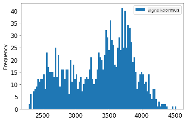
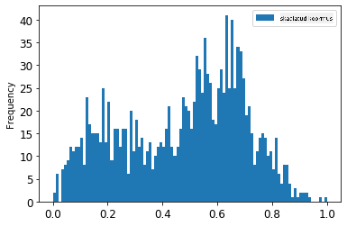

<!--
CO_OP_TRANSLATOR_METADATA:
{
  "original_hash": "917dbf890db71a322f306050cb284749",
  "translation_date": "2025-10-11T11:59:28+00:00",
  "source_file": "7-TimeSeries/2-ARIMA/README.md",
  "language_code": "et"
}
-->
# Ajaarvude prognoosimine ARIMA-ga

Eelmises õppetükis õppisite veidi ajaarvude prognoosimisest ja laadisite andmekogumi, mis näitab elektrikoormuse kõikumisi ajaperioodi jooksul.

[](https://youtu.be/IUSk-YDau10 "Sissejuhatus ARIMA-sse")

> 🎥 Klõpsake ülaloleval pildil, et vaadata videot: Lühike sissejuhatus ARIMA mudelitesse. Näide on tehtud R-is, kuid kontseptsioonid on universaalsed.

## [Eel-loengu viktoriin](https://ff-quizzes.netlify.app/en/ml/)

## Sissejuhatus

Selles õppetükis avastate konkreetse viisi mudelite loomiseks [ARIMA: *A*uto*R*egressiivne *I*ntegratsiooniga *M*oving *A*verage](https://wikipedia.org/wiki/Autoregressive_integrated_moving_average). ARIMA mudelid sobivad eriti hästi andmete jaoks, mis näitavad [mittejaamalisust](https://wikipedia.org/wiki/Stationary_process).

## Üldised kontseptsioonid

ARIMA-ga töötamiseks peate teadma mõningaid kontseptsioone:

- 🎓 **Jaamalisus**. Statistilises kontekstis viitab jaamalisus andmetele, mille jaotus ei muutu ajas nihutamisel. Mittejaamalised andmed näitavad kõikumisi trendide tõttu, mis tuleb analüüsimiseks ümber kujundada. Näiteks hooajalisus võib põhjustada andmete kõikumisi, mida saab kõrvaldada protsessiga, mida nimetatakse 'hooajaline diferentseerimine'.

- 🎓 **[Diferentseerimine](https://wikipedia.org/wiki/Autoregressive_integrated_moving_average#Differencing)**. Diferentseerimine viitab statistilises kontekstis protsessile, kus mittejaamalised andmed muudetakse jaamaliseks, eemaldades nende mittekonstantsed trendid. "Diferentseerimine eemaldab ajaarvude taseme muutused, kõrvaldades trendi ja hooajalisuse ning stabiliseerides seeläbi ajaarvude keskmise." [Shixiongi jt. artikkel](https://arxiv.org/abs/1904.07632)

## ARIMA ajaarvude kontekstis

Vaatame ARIMA osi lähemalt, et paremini mõista, kuidas see aitab meil ajaarvude modelleerimisel ja prognooside tegemisel.

- **AR - AutoRegressiivne**. Autoregressiivsed mudelid, nagu nimigi viitab, vaatavad ajas tagasi, et analüüsida teie andmete varasemaid väärtusi ja teha nende kohta oletusi. Neid varasemaid väärtusi nimetatakse 'viivitusteks'. Näiteks andmed, mis näitavad igakuist pliiatsimüüki. Iga kuu müügisumma oleks andmekogumis 'muutuv väärtus'. See mudel ehitatakse nii, et "huvipakkuv muutuv väärtus regresseeritakse oma viivitatud (st varasemate) väärtuste suhtes." [Wikipedia](https://wikipedia.org/wiki/Autoregressive_integrated_moving_average)

- **I - Integreeritud**. Erinevalt sarnastest 'ARMA' mudelitest viitab ARIMA-s 'I' selle *[integreeritud](https://wikipedia.org/wiki/Order_of_integration)* aspektile. Andmed integreeritakse, kui rakendatakse diferentseerimise samme, et kõrvaldada mittejaamalisus.

- **MA - Liikuv Keskmine**. Mudeli [liikuva keskmise](https://wikipedia.org/wiki/Moving-average_model) aspekt viitab väljundmuutujale, mis määratakse kindlaks, jälgides viivituste praeguseid ja varasemaid väärtusi.

Kokkuvõte: ARIMA-d kasutatakse mudeli kohandamiseks ajaarvude erivormiga nii täpselt kui võimalik.

## Harjutus - ARIMA mudeli loomine

Avage selle õppetüki [_/working_](https://github.com/microsoft/ML-For-Beginners/tree/main/7-TimeSeries/2-ARIMA/working) kaust ja leidke [_notebook.ipynb_](https://github.com/microsoft/ML-For-Beginners/blob/main/7-TimeSeries/2-ARIMA/working/notebook.ipynb) fail.

1. Käivitage märkmik, et laadida `statsmodels` Python'i teek; seda vajate ARIMA mudelite jaoks.

1. Laadige vajalikud teegid.

1. Nüüd laadige veel mõned teegid, mis on kasulikud andmete visualiseerimiseks:

    ```python
    import os
    import warnings
    import matplotlib.pyplot as plt
    import numpy as np
    import pandas as pd
    import datetime as dt
    import math

    from pandas.plotting import autocorrelation_plot
    from statsmodels.tsa.statespace.sarimax import SARIMAX
    from sklearn.preprocessing import MinMaxScaler
    from common.utils import load_data, mape
    from IPython.display import Image

    %matplotlib inline
    pd.options.display.float_format = '{:,.2f}'.format
    np.set_printoptions(precision=2)
    warnings.filterwarnings("ignore") # specify to ignore warning messages
    ```

1. Laadige andmed `/data/energy.csv` failist Pandase andmeraamistikku ja vaadake neid:

    ```python
    energy = load_data('./data')[['load']]
    energy.head(10)
    ```

1. Joonistage kõik saadaval olevad energiatarbimise andmed ajavahemikus jaanuar 2012 kuni detsember 2014. Üllatusi ei tohiks olla, kuna nägime neid andmeid eelmises õppetükis:

    ```python
    energy.plot(y='load', subplots=True, figsize=(15, 8), fontsize=12)
    plt.xlabel('timestamp', fontsize=12)
    plt.ylabel('load', fontsize=12)
    plt.show()
    ```

    Nüüd loome mudeli!

### Treening- ja testandmekogumite loomine

Nüüd, kui andmed on laaditud, saate need jagada treening- ja testandmekogumiteks. Treenite oma mudelit treeningkogumil. Nagu tavaliselt, pärast mudeli treenimist hindate selle täpsust testkogumi abil. Peate tagama, et testkogum hõlmaks hilisemat ajaperioodi kui treeningkogum, et mudel ei saaks tuleviku ajaperioodidest teavet.

1. Eraldage treeningkogumile kahekuuline periood 1. septembrist kuni 31. oktoobrini 2014. Testkogum hõlmab kahekuulist perioodi 1. novembrist kuni 31. detsembrini 2014:

    ```python
    train_start_dt = '2014-11-01 00:00:00'
    test_start_dt = '2014-12-30 00:00:00'
    ```

    Kuna need andmed kajastavad igapäevast energiatarbimist, on tugev hooajaline muster, kuid tarbimine on kõige sarnasem hiljutiste päevade tarbimisega.

1. Visualiseerige erinevused:

    ```python
    energy[(energy.index < test_start_dt) & (energy.index >= train_start_dt)][['load']].rename(columns={'load':'train'}) \
        .join(energy[test_start_dt:][['load']].rename(columns={'load':'test'}), how='outer') \
        .plot(y=['train', 'test'], figsize=(15, 8), fontsize=12)
    plt.xlabel('timestamp', fontsize=12)
    plt.ylabel('load', fontsize=12)
    plt.show()
    ```

    

    Seetõttu peaks suhteliselt väikese ajavahemiku kasutamine treeningandmete jaoks olema piisav.

    > Märkus: Kuna funktsioon, mida kasutame ARIMA mudeli sobitamiseks, kasutab sobitamise ajal sisemist valideerimist, jätame valideerimisandmed välja.

### Andmete ettevalmistamine treenimiseks

Nüüd peate andmed treenimiseks ette valmistama, filtreerides ja skaleerides oma andmeid. Filtreerige oma andmekogum, et sisaldada ainult vajalikke ajaperioode ja veerge, ning skaleerige andmed, et need oleksid vahemikus 0,1.

1. Filtreerige algne andmekogum, et sisaldada ainult eelmainitud ajaperioode ja ainult vajalikke veerge 'load' ja kuupäev:

    ```python
    train = energy.copy()[(energy.index >= train_start_dt) & (energy.index < test_start_dt)][['load']]
    test = energy.copy()[energy.index >= test_start_dt][['load']]

    print('Training data shape: ', train.shape)
    print('Test data shape: ', test.shape)
    ```

    Näete andmete kuju:

    ```output
    Training data shape:  (1416, 1)
    Test data shape:  (48, 1)
    ```

1. Skaleerige andmed vahemikku (0, 1).

    ```python
    scaler = MinMaxScaler()
    train['load'] = scaler.fit_transform(train)
    train.head(10)
    ```

1. Visualiseerige algsed vs. skaleeritud andmed:

    ```python
    energy[(energy.index >= train_start_dt) & (energy.index < test_start_dt)][['load']].rename(columns={'load':'original load'}).plot.hist(bins=100, fontsize=12)
    train.rename(columns={'load':'scaled load'}).plot.hist(bins=100, fontsize=12)
    plt.show()
    ```

    

    > Algne andmestik

    

    > Skaleeritud andmestik

1. Nüüd, kui olete skaleeritud andmed kalibreerinud, saate skaleerida testandmed:

    ```python
    test['load'] = scaler.transform(test)
    test.head()
    ```

### ARIMA rakendamine

On aeg ARIMA rakendada! Kasutate nüüd varem installitud `statsmodels` teeki.

Nüüd peate järgima mitmeid samme:

   1. Määratlege mudel, kutsudes `SARIMAX()` ja edastades mudeli parameetrid: p, d ja q parameetrid ning P, D ja Q parameetrid.
   2. Valmistage mudel treeningandmete jaoks, kutsudes funktsiooni `fit()`.
   3. Tehke prognoosid, kutsudes funktsiooni `forecast()` ja määrates prognoosimiseks sammude arvu (horisont).

> 🎓 Milleks kõik need parameetrid? ARIMA mudelis on 3 parameetrit, mida kasutatakse ajaarvude peamiste aspektide modelleerimiseks: hooajalisus, trend ja müra. Need parameetrid on:

`p`: parameeter, mis on seotud mudeli autoregressiivse aspektiga, mis hõlmab *varasemaid* väärtusi.
`d`: parameeter, mis on seotud mudeli integreeritud osaga, mis mõjutab ajaarvude *diferentseerimise* (🎓 mäletate diferentseerimist 👆?) hulka.
`q`: parameeter, mis on seotud mudeli liikuva keskmise osaga.

> Märkus: Kui teie andmetel on hooajaline aspekt - nagu sellel andmestikul -, kasutame hooajalist ARIMA mudelit (SARIMA). Sel juhul peate kasutama teist parameetrite komplekti: `P`, `D` ja `Q`, mis kirjeldavad samu seoseid nagu `p`, `d` ja `q`, kuid vastavad mudeli hooajalistele komponentidele.

1. Alustage oma eelistatud horisondi väärtuse määramisest. Proovime 3 tundi:

    ```python
    # Specify the number of steps to forecast ahead
    HORIZON = 3
    print('Forecasting horizon:', HORIZON, 'hours')
    ```

    ARIMA mudeli parimate väärtuste valimine võib olla keeruline, kuna see on mõnevõrra subjektiivne ja aeganõudev. Võite kaaluda `auto_arima()` funktsiooni kasutamist [`pyramid` teegist](https://alkaline-ml.com/pmdarima/0.9.0/modules/generated/pyramid.arima.auto_arima.html).

1. Praegu proovige mõningaid käsitsi valikuid, et leida hea mudel.

    ```python
    order = (4, 1, 0)
    seasonal_order = (1, 1, 0, 24)

    model = SARIMAX(endog=train, order=order, seasonal_order=seasonal_order)
    results = model.fit()

    print(results.summary())
    ```

    Tulemuste tabel trükitakse.

Olete loonud oma esimese mudeli! Nüüd peame leidma viisi selle hindamiseks.

### Mudeli hindamine

Mudeli hindamiseks saate kasutada nn `edasi liikumise` valideerimist. Praktikas treenitakse ajaarvude mudeleid iga kord, kui uued andmed muutuvad kättesaadavaks. See võimaldab mudelil teha parima prognoosi igal ajasammul.

Selle tehnika abil alustades ajaarvude algusest, treenige mudelit treeningandmekogumil. Seejärel tehke prognoos järgmisel ajasammul. Prognoosi hinnatakse teadaoleva väärtuse suhtes. Treeningkogumit laiendatakse, et lisada teadaolev väärtus, ja protsessi korratakse.

> Märkus: Treeningkogumi akna fikseerimine tõhusamaks treenimiseks on soovitatav, nii et iga kord, kui lisate treeningkogumile uue vaatluse, eemaldate kogumi algusest vaatluse.

See protsess annab tugevama hinnangu sellele, kuidas mudel praktikas toimib. Kuid see toob kaasa arvutusliku kulu nii paljude mudelite loomisel. See on vastuvõetav, kui andmed on väikesed või mudel on lihtne, kuid võib olla probleemiks suuremahuliste andmete korral.

Edasi liikumise valideerimine on ajaarvude mudelite hindamise kuldstandard ja seda soovitatakse teie enda projektide jaoks.

1. Kõigepealt looge testandmepunkt iga HORISONT-sammu jaoks.

    ```python
    test_shifted = test.copy()

    for t in range(1, HORIZON+1):
        test_shifted['load+'+str(t)] = test_shifted['load'].shift(-t, freq='H')

    test_shifted = test_shifted.dropna(how='any')
    test_shifted.head(5)
    ```

    |            |          | load | load+1 | load+2 |
    | ---------- | -------- | ---- | ------ | ------ |
    | 2014-12-30 | 00:00:00 | 0.33 | 0.29   | 0.27   |
    | 2014-12-30 | 01:00:00 | 0.29 | 0.27   | 0.27   |
    | 2014-12-30 | 02:00:00 | 0.27 | 0.27   | 0.30   |
    | 2014-12-30 | 03:00:00 | 0.27 | 0.30   | 0.41   |
    | 2014-12-30 | 04:00:00 | 0.30 | 0.41   | 0.57   |

    Andmed nihutatakse horisontaalselt vastavalt horisont-punktile.

1. Tehke prognoosid oma testandmetele, kasutades seda libiseva akna lähenemist testandmete pikkuse suuruses tsüklis:

    ```python
    %%time
    training_window = 720 # dedicate 30 days (720 hours) for training

    train_ts = train['load']
    test_ts = test_shifted

    history = [x for x in train_ts]
    history = history[(-training_window):]

    predictions = list()

    order = (2, 1, 0)
    seasonal_order = (1, 1, 0, 24)

    for t in range(test_ts.shape[0]):
        model = SARIMAX(endog=history, order=order, seasonal_order=seasonal_order)
        model_fit = model.fit()
        yhat = model_fit.forecast(steps = HORIZON)
        predictions.append(yhat)
        obs = list(test_ts.iloc[t])
        # move the training window
        history.append(obs[0])
        history.pop(0)
        print(test_ts.index[t])
        print(t+1, ': predicted =', yhat, 'expected =', obs)
    ```

    Näete treeningu toimumist:

    ```output
    2014-12-30 00:00:00
    1 : predicted = [0.32 0.29 0.28] expected = [0.32945389435989236, 0.2900626678603402, 0.2739480752014323]

    2014-12-30 01:00:00
    2 : predicted = [0.3  0.29 0.3 ] expected = [0.2900626678603402, 0.2739480752014323, 0.26812891674127126]

    2014-12-30 02:00:00
    3 : predicted = [0.27 0.28 0.32] expected = [0.2739480752014323, 0.26812891674127126, 0.3025962399283795]
    ```

1. Võrrelge prognoose tegeliku koormusega:

    ```python
    eval_df = pd.DataFrame(predictions, columns=['t+'+str(t) for t in range(1, HORIZON+1)])
    eval_df['timestamp'] = test.index[0:len(test.index)-HORIZON+1]
    eval_df = pd.melt(eval_df, id_vars='timestamp', value_name='prediction', var_name='h')
    eval_df['actual'] = np.array(np.transpose(test_ts)).ravel()
    eval_df[['prediction', 'actual']] = scaler.inverse_transform(eval_df[['prediction', 'actual']])
    eval_df.head()
    ```

    Väljund
    |     |            | timestamp | h   | prediction | actual   |
    | --- | ---------- | --------- | --- | ---------- | -------- |
    | 0   | 2014-12-30 | 00:00:00  | t+1 | 3,008.74   | 3,023.00 |
    | 1   | 2014-12-30 | 01:00:00  | t+1 | 2,955.53   | 2,935.00 |
    | 2   | 2014-12-30 | 02:00:00  | t+1 | 2,900.17   | 2,899.00 |
    | 3   | 2014-12-30 | 03:00:00  | t+1 | 2,917.69   | 2,886.00 |
    | 4   | 2014-12-30 | 04:00:00  | t+1 | 2,946.99   | 2,963.00 |

    Vaadake tunnipõhiste andmete prognoosi võrreldes tegeliku koormusega. Kui täpne see on?

### Kontrollige mudeli täpsust

Kontrollige oma mudeli täpsust, testides selle keskmist absoluutset protsentviga (MAPE) kõigi prognooside puhul.

> **🧮 Näidake mulle matemaatikat**
>
> 
>
> [MAPE](https://www.linkedin.com/pulse/what-mape-mad-msd-time-series-allameh-statistics/) kasutatakse ennustustäpsuse näitamiseks suhtarvuna, mis on määratletud ülaltoodud valemi järgi. Erinevus tegeliku<sub>t</sub> ja prognoositud<sub>t</sub> vahel jagatakse tegeliku<sub>t</sub> väärtusega. "Selle arvutuse absoluutväärtus summeeritakse iga prognoositud ajahetke kohta ja jagatakse sobitatud punktide arvuga n." [wikipedia](https://wikipedia.org/wiki/Mean_absolute_percentage_error)

1. Väljenda valem koodis:

    ```python
    if(HORIZON > 1):
        eval_df['APE'] = (eval_df['prediction'] - eval_df['actual']).abs() / eval_df['actual']
        print(eval_df.groupby('h')['APE'].mean())
    ```

1. Arvuta ühe sammu MAPE:

    ```python
    print('One step forecast MAPE: ', (mape(eval_df[eval_df['h'] == 't+1']['prediction'], eval_df[eval_df['h'] == 't+1']['actual']))*100, '%')
    ```

    Ühe sammu prognoosi MAPE:  0.5570581332313952 %

1. Väljasta mitme sammu prognoosi MAPE:

    ```python
    print('Multi-step forecast MAPE: ', mape(eval_df['prediction'], eval_df['actual'])*100, '%')
    ```

    ```output
    Multi-step forecast MAPE:  1.1460048657704118 %
    ```

    Madal number on parim: arvestage, et prognoos, mille MAPE on 10, eksib 10%.

1. Kuid nagu alati, on sellist täpsuse mõõtmist lihtsam visuaalselt näha, seega joonistame selle:

    ```python
     if(HORIZON == 1):
        ## Plotting single step forecast
        eval_df.plot(x='timestamp', y=['actual', 'prediction'], style=['r', 'b'], figsize=(15, 8))

    else:
        ## Plotting multi step forecast
        plot_df = eval_df[(eval_df.h=='t+1')][['timestamp', 'actual']]
        for t in range(1, HORIZON+1):
            plot_df['t+'+str(t)] = eval_df[(eval_df.h=='t+'+str(t))]['prediction'].values

        fig = plt.figure(figsize=(15, 8))
        ax = plt.plot(plot_df['timestamp'], plot_df['actual'], color='red', linewidth=4.0)
        ax = fig.add_subplot(111)
        for t in range(1, HORIZON+1):
            x = plot_df['timestamp'][(t-1):]
            y = plot_df['t+'+str(t)][0:len(x)]
            ax.plot(x, y, color='blue', linewidth=4*math.pow(.9,t), alpha=math.pow(0.8,t))

        ax.legend(loc='best')

    plt.xlabel('timestamp', fontsize=12)
    plt.ylabel('load', fontsize=12)
    plt.show()
    ```

    

🏆 Väga kena graafik, mis näitab mudelit hea täpsusega. Tubli töö!

---

## 🚀Väljakutse

Uurige erinevaid viise, kuidas testida aegrea mudeli täpsust. Selles tunnis käsitleme MAPE-d, kuid kas on olemas ka teisi meetodeid, mida saaksite kasutada? Uurige neid ja lisage märkusi. Kasulik dokument on leitav [siit](https://otexts.com/fpp2/accuracy.html)

## [Loengu järgne viktoriin](https://ff-quizzes.netlify.app/en/ml/)

## Ülevaade ja iseseisev õppimine

See tund käsitleb ainult aegrea prognoosimise põhialuseid ARIMA-ga. Võtke aega, et süvendada oma teadmisi, uurides [seda repositooriumi](https://microsoft.github.io/forecasting/) ja selle erinevaid mudelitüüpe, et õppida teisi viise aegrea mudelite loomiseks.

## Ülesanne

[Uus ARIMA mudel](assignment.md)

---

**Lahtiütlus**:  
See dokument on tõlgitud AI tõlketeenuse [Co-op Translator](https://github.com/Azure/co-op-translator) abil. Kuigi püüame tagada täpsust, palume arvestada, et automaatsed tõlked võivad sisaldada vigu või ebatäpsusi. Algne dokument selle algses keeles tuleks pidada autoriteetseks allikaks. Olulise teabe puhul soovitame kasutada professionaalset inimtõlget. Me ei vastuta selle tõlke kasutamisest tulenevate arusaamatuste või valesti tõlgenduste eest.