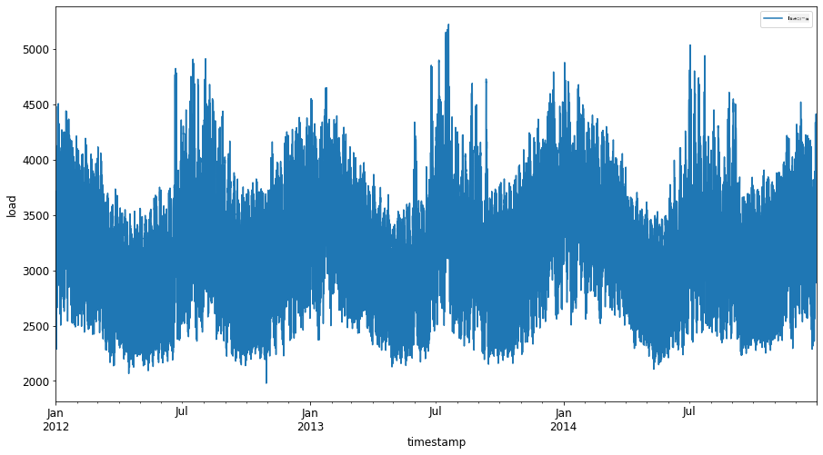
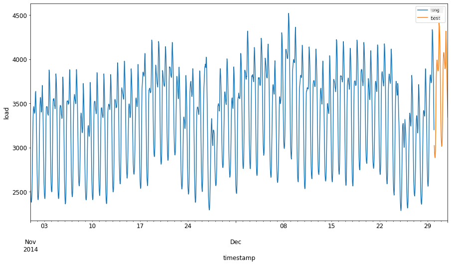

<!--
CO_OP_TRANSLATOR_METADATA:
{
  "original_hash": "482bccabe1df958496ea71a3667995cd",
  "translation_date": "2025-10-11T12:02:40+00:00",
  "source_file": "7-TimeSeries/3-SVR/README.md",
  "language_code": "et"
}
-->
# Ajasarja prognoosimine toetavate vektorite regressori abil

Eelmises õppetükis õppisite, kuidas kasutada ARIMA mudelit ajasarjade prognoosimiseks. Nüüd vaatame toetavate vektorite regressori mudelit, mis on regressioonimudel pidevate andmete ennustamiseks.

## [Eeltesti viktoriin](https://ff-quizzes.netlify.app/en/ml/) 

## Sissejuhatus

Selles õppetükis avastate konkreetse viisi mudelite loomiseks [**SVM**: **S**upport **V**ector **M**achine](https://en.wikipedia.org/wiki/Support-vector_machine) regressiooni jaoks ehk **SVR: Support Vector Regressor**.

### SVR ajasarjade kontekstis [^1]

Enne kui mõistate SVR-i tähtsust ajasarjade prognoosimisel, on siin mõned olulised mõisted, mida peate teadma:

- **Regressioon:** Juhendatud õppetehnika pidevate väärtuste ennustamiseks antud sisendite põhjal. Idee seisneb kõvera (või joone) sobitamises tunnuste ruumis, mis sisaldab maksimaalset arvu andmepunkte. [Klõpsake siin](https://en.wikipedia.org/wiki/Regression_analysis), et saada rohkem teavet.
- **Toetavate vektorite masin (SVM):** Juhendatud masinõppe mudel, mida kasutatakse klassifitseerimiseks, regressiooniks ja kõrvalekallete tuvastamiseks. Mudel on hüpertasand tunnuste ruumis, mis klassifitseerimise korral toimib piirina ja regressiooni korral parima sobivusega joonena. SVM-is kasutatakse tavaliselt kernel-funktsiooni, et teisendada andmekogum kõrgema dimensioonide arvuga ruumi, et need oleksid kergemini eristatavad. [Klõpsake siin](https://en.wikipedia.org/wiki/Support-vector_machine), et saada rohkem teavet SVM-ide kohta.
- **Toetavate vektorite regressor (SVR):** SVM-i tüüp, mis leiab parima sobivusega joone (mis SVM-i puhul on hüpertasand), millel on maksimaalne arv andmepunkte.

### Miks SVR? [^1]

Eelmises õppetükis õppisite ARIMA-st, mis on väga edukas statistiline lineaarne meetod ajasarjade andmete prognoosimiseks. Kuid paljudel juhtudel on ajasarjade andmetel *mittelineaarsus*, mida lineaarsete mudelitega ei saa kaardistada. Sellistel juhtudel muudab SVM-i võime arvestada andmete mittelineaarsust regressioonülesannetes SVR-i edukaks ajasarjade prognoosimisel.

## Harjutus - SVR-mudeli loomine

Esimesed sammud andmete ettevalmistamiseks on samad, mis eelmises õppetükis [ARIMA](https://github.com/microsoft/ML-For-Beginners/tree/main/7-TimeSeries/2-ARIMA) kohta.

Avage selle õppetüki [_/working_](https://github.com/microsoft/ML-For-Beginners/tree/main/7-TimeSeries/3-SVR/working) kaust ja leidke [_notebook.ipynb_](https://github.com/microsoft/ML-For-Beginners/blob/main/7-TimeSeries/3-SVR/working/notebook.ipynb) fail.[^2]

1. Käivitage märkmik ja importige vajalikud teegid: [^2]

   ```python
   import sys
   sys.path.append('../../')
   ```

   ```python
   import os
   import warnings
   import matplotlib.pyplot as plt
   import numpy as np
   import pandas as pd
   import datetime as dt
   import math
   
   from sklearn.svm import SVR
   from sklearn.preprocessing import MinMaxScaler
   from common.utils import load_data, mape
   ```

2. Laadige andmed `/data/energy.csv` failist Pandase andmeraami ja vaadake neid: [^2]

   ```python
   energy = load_data('../../data')[['load']]
   ```

3. Joonistage kõik saadaval olevad energiandmed ajavahemikus jaanuar 2012 kuni detsember 2014: [^2]

   ```python
   energy.plot(y='load', subplots=True, figsize=(15, 8), fontsize=12)
   plt.xlabel('timestamp', fontsize=12)
   plt.ylabel('load', fontsize=12)
   plt.show()
   ```

   

   Nüüd loome oma SVR-mudeli.

### Treening- ja testandmekogumite loomine

Nüüd on teie andmed laaditud, nii et saate need jagada treening- ja testandmekogumiteks. Seejärel muudate andmed ajasammude põhjal loodud andmekogumiks, mida SVR vajab. Treenite oma mudelit treeningkogumil. Pärast mudeli treenimist hindate selle täpsust treeningkogumil, testkogumil ja seejärel kogu andmekogumil, et näha üldist jõudlust. Peate tagama, et testkogum hõlmaks hilisemat ajavahemikku treeningkogumist, et mudel ei saaks teavet tulevaste ajaperioodide kohta [^2] (olukord, mida nimetatakse *üleõppeks*).

1. Eraldage treeningkogumile kahekuuline periood 1. septembrist kuni 31. oktoobrini 2014. Testkogum hõlmab kahekuulist perioodi 1. novembrist kuni 31. detsembrini 2014: [^2]

   ```python
   train_start_dt = '2014-11-01 00:00:00'
   test_start_dt = '2014-12-30 00:00:00'
   ```

2. Visualiseerige erinevused: [^2]

   ```python
   energy[(energy.index < test_start_dt) & (energy.index >= train_start_dt)][['load']].rename(columns={'load':'train'}) \
       .join(energy[test_start_dt:][['load']].rename(columns={'load':'test'}), how='outer') \
       .plot(y=['train', 'test'], figsize=(15, 8), fontsize=12)
   plt.xlabel('timestamp', fontsize=12)
   plt.ylabel('load', fontsize=12)
   plt.show()
   ```

   

### Andmete ettevalmistamine treenimiseks

Nüüd peate andmed treenimiseks ette valmistama, tehes andmete filtreerimise ja skaleerimise. Filtreerige oma andmekogum, et kaasata ainult vajalikud ajavahemikud ja veerud, ning skaleerige andmed, et need oleksid vahemikus 0,1.

1. Filtreerige algne andmekogum, et kaasata ainult ülalmainitud ajavahemikud ja ainult vajalik veerg 'load' koos kuupäevaga: [^2]

   ```python
   train = energy.copy()[(energy.index >= train_start_dt) & (energy.index < test_start_dt)][['load']]
   test = energy.copy()[energy.index >= test_start_dt][['load']]
   
   print('Training data shape: ', train.shape)
   print('Test data shape: ', test.shape)
   ```

   ```output
   Training data shape:  (1416, 1)
   Test data shape:  (48, 1)
   ```
   
2. Skaleerige treeningandmed vahemikku (0, 1): [^2]

   ```python
   scaler = MinMaxScaler()
   train['load'] = scaler.fit_transform(train)
   ```
   
4. Nüüd skaleerige testandmed: [^2]

   ```python
   test['load'] = scaler.transform(test)
   ```

### Andmete loomine ajasammudega [^1]

SVR-i jaoks teisendate sisendandmed vormingusse `[batch, timesteps]`. Seega muudate olemasolevad `train_data` ja `test_data` selliselt, et tekib uus dimensioon, mis viitab ajasammudele.

```python
# Converting to numpy arrays
train_data = train.values
test_data = test.values
```

Selles näites võtame `timesteps = 5`. Seega on mudeli sisendid andmed esimese 4 ajasammu kohta ja väljundiks on andmed 5. ajasammu kohta.

```python
timesteps=5
```

Treeningandmete teisendamine 2D tensoriks, kasutades pesastatud loendite mõistmist:

```python
train_data_timesteps=np.array([[j for j in train_data[i:i+timesteps]] for i in range(0,len(train_data)-timesteps+1)])[:,:,0]
train_data_timesteps.shape
```

```output
(1412, 5)
```

Testandmete teisendamine 2D tensoriks:

```python
test_data_timesteps=np.array([[j for j in test_data[i:i+timesteps]] for i in range(0,len(test_data)-timesteps+1)])[:,:,0]
test_data_timesteps.shape
```

```output
(44, 5)
```

Treening- ja testandmete sisendite ja väljundite valimine:

```python
x_train, y_train = train_data_timesteps[:,:timesteps-1],train_data_timesteps[:,[timesteps-1]]
x_test, y_test = test_data_timesteps[:,:timesteps-1],test_data_timesteps[:,[timesteps-1]]

print(x_train.shape, y_train.shape)
print(x_test.shape, y_test.shape)
```

```output
(1412, 4) (1412, 1)
(44, 4) (44, 1)
```

### SVR-i rakendamine [^1]

Nüüd on aeg SVR-i rakendada. Selle rakenduse kohta lisateabe saamiseks võite viidata [sellele dokumentatsioonile](https://scikit-learn.org/stable/modules/generated/sklearn.svm.SVR.html). Meie rakenduse jaoks järgime neid samme:

  1. Määratlege mudel, kutsudes `SVR()` ja edastades mudeli hüperparameetrid: kernel, gamma, c ja epsilon
  2. Valmistage mudel treeningandmete jaoks, kutsudes `fit()` funktsiooni
  3. Tehke ennustusi, kutsudes `predict()` funktsiooni

Nüüd loome SVR-mudeli. Siin kasutame [RBF kernelit](https://scikit-learn.org/stable/modules/svm.html#parameters-of-the-rbf-kernel) ja määrame hüperparameetrid gamma, C ja epsilon vastavalt 0.5, 10 ja 0.05.

```python
model = SVR(kernel='rbf',gamma=0.5, C=10, epsilon = 0.05)
```

#### Mudeli sobitamine treeningandmetele [^1]

```python
model.fit(x_train, y_train[:,0])
```

```output
SVR(C=10, cache_size=200, coef0=0.0, degree=3, epsilon=0.05, gamma=0.5,
    kernel='rbf', max_iter=-1, shrinking=True, tol=0.001, verbose=False)
```

#### Mudeli ennustuste tegemine [^1]

```python
y_train_pred = model.predict(x_train).reshape(-1,1)
y_test_pred = model.predict(x_test).reshape(-1,1)

print(y_train_pred.shape, y_test_pred.shape)
```

```output
(1412, 1) (44, 1)
```

Olete oma SVR-i ehitanud! Nüüd peame seda hindama.

### Mudeli hindamine [^1]

Hindamiseks skaleerime kõigepealt andmed tagasi algsele skaalale. Seejärel, et kontrollida jõudlust, joonistame algse ja prognoositud ajasarjade graafiku ning prindime ka MAPE tulemuse.

Skaleerige prognoositud ja algne väljund:

```python
# Scaling the predictions
y_train_pred = scaler.inverse_transform(y_train_pred)
y_test_pred = scaler.inverse_transform(y_test_pred)

print(len(y_train_pred), len(y_test_pred))
```

```python
# Scaling the original values
y_train = scaler.inverse_transform(y_train)
y_test = scaler.inverse_transform(y_test)

print(len(y_train), len(y_test))
```

#### Kontrollige mudeli jõudlust treening- ja testandmetel [^1]

Ekstraheerime ajatempleid andmekogumist, et näidata neid graafiku x-teljel. Pange tähele, et kasutame esimesi ```timesteps-1``` väärtusi esimese väljundi sisendina, nii et väljundi ajatempleid alustatakse pärast seda.

```python
train_timestamps = energy[(energy.index < test_start_dt) & (energy.index >= train_start_dt)].index[timesteps-1:]
test_timestamps = energy[test_start_dt:].index[timesteps-1:]

print(len(train_timestamps), len(test_timestamps))
```

```output
1412 44
```

Joonistage treeningandmete prognoosid:

```python
plt.figure(figsize=(25,6))
plt.plot(train_timestamps, y_train, color = 'red', linewidth=2.0, alpha = 0.6)
plt.plot(train_timestamps, y_train_pred, color = 'blue', linewidth=0.8)
plt.legend(['Actual','Predicted'])
plt.xlabel('Timestamp')
plt.title("Training data prediction")
plt.show()
```


Prindige MAPE treeningandmete jaoks

```python
print('MAPE for training data: ', mape(y_train_pred, y_train)*100, '%')
```

```output
MAPE for training data: 1.7195710200875551 %
```

Joonistage testandmete prognoosid

```python
plt.figure(figsize=(10,3))
plt.plot(test_timestamps, y_test, color = 'red', linewidth=2.0, alpha = 0.6)
plt.plot(test_timestamps, y_test_pred, color = 'blue', linewidth=0.8)
plt.legend(['Actual','Predicted'])
plt.xlabel('Timestamp')
plt.show()
```


Prindige MAPE testandmete jaoks

```python
print('MAPE for testing data: ', mape(y_test_pred, y_test)*100, '%')
```

```output
MAPE for testing data:  1.2623790187854018 %
```

🏆 Teil on testandmekogumil väga hea tulemus!

### Kontrollige mudeli jõudlust kogu andmekogumil [^1]

```python
# Extracting load values as numpy array
data = energy.copy().values

# Scaling
data = scaler.transform(data)

# Transforming to 2D tensor as per model input requirement
data_timesteps=np.array([[j for j in data[i:i+timesteps]] for i in range(0,len(data)-timesteps+1)])[:,:,0]
print("Tensor shape: ", data_timesteps.shape)

# Selecting inputs and outputs from data
X, Y = data_timesteps[:,:timesteps-1],data_timesteps[:,[timesteps-1]]
print("X shape: ", X.shape,"\nY shape: ", Y.shape)
```

```output
Tensor shape:  (26300, 5)
X shape:  (26300, 4) 
Y shape:  (26300, 1)
```

```python
# Make model predictions
Y_pred = model.predict(X).reshape(-1,1)

# Inverse scale and reshape
Y_pred = scaler.inverse_transform(Y_pred)
Y = scaler.inverse_transform(Y)
```

```python
plt.figure(figsize=(30,8))
plt.plot(Y, color = 'red', linewidth=2.0, alpha = 0.6)
plt.plot(Y_pred, color = 'blue', linewidth=0.8)
plt.legend(['Actual','Predicted'])
plt.xlabel('Timestamp')
plt.show()
```


```python
print('MAPE: ', mape(Y_pred, Y)*100, '%')
```

```output
MAPE:  2.0572089029888656 %
```


🏆 Väga ilusad graafikud, mis näitavad mudelit hea täpsusega. Tubli töö!

---

## 🚀Väljakutse

- Proovige mudelit luues hüperparameetreid (gamma, C, epsilon) muuta ja hinnake andmeid, et näha, milline hüperparameetrite komplekt annab testandmetel parima tulemuse. Nende hüperparameetrite kohta lisateabe saamiseks võite viidata [sellele dokumendile](https://scikit-learn.org/stable/modules/svm.html#parameters-of-the-rbf-kernel). 
- Proovige mudeli jaoks kasutada erinevaid kernel-funktsioone ja analüüsige nende jõudlust andmekogumil. Kasulik dokument on saadaval [siin](https://scikit-learn.org/stable/modules/svm.html#kernel-functions).
- Proovige mudeli jaoks kasutada erinevaid `timesteps` väärtusi, et teha prognoose.

## [Järeltesti viktoriin](https://ff-quizzes.netlify.app/en/ml/)

## Ülevaade ja iseseisev õppimine

See õppetund tutvustas SVR-i rakendust ajasarjade prognoosimiseks. SVR-i kohta lisateabe saamiseks võite viidata [sellele blogile](https://www.analyticsvidhya.com/blog/2020/03/support-vector-regression-tutorial-for-machine-learning/). See [scikit-learn'i dokumentatsioon](https://scikit-learn.org/stable/modules/svm.html) pakub põhjalikumat selgitust SVM-ide kohta üldiselt, [SVR-ide](https://scikit-learn.org/stable/modules/svm.html#regression) kohta ja ka muid rakenduse üksikasju, nagu erinevad [kernel-funktsioonid](https://scikit-learn.org/stable/modules/svm.html#kernel-functions), mida saab kasutada, ja nende parameetrid.

## Ülesanne

[Uus SVR-mudel](assignment.md)

## Autorid

[^1]: Selle jaotise tekst, kood ja väljund on panustanud [@AnirbanMukherjeeXD](https://github.com/AnirbanMukherjeeXD)
[^2]: Selle jaotise tekst, kood ja väljund on võetud [ARIMA](https://github.com/microsoft/ML-For-Beginners/tree/main/7-TimeSeries/2-ARIMA)

---

**Lahtiütlus**:  
See dokument on tõlgitud AI tõlketeenuse [Co-op Translator](https://github.com/Azure/co-op-translator) abil. Kuigi püüame tagada täpsust, palume arvestada, et automaatsed tõlked võivad sisaldada vigu või ebatäpsusi. Algne dokument selle algses keeles tuleks pidada autoriteetseks allikaks. Olulise teabe puhul soovitame kasutada professionaalset inimtõlget. Me ei vastuta selle tõlke kasutamisest tulenevate arusaamatuste või valesti tõlgenduste eest.